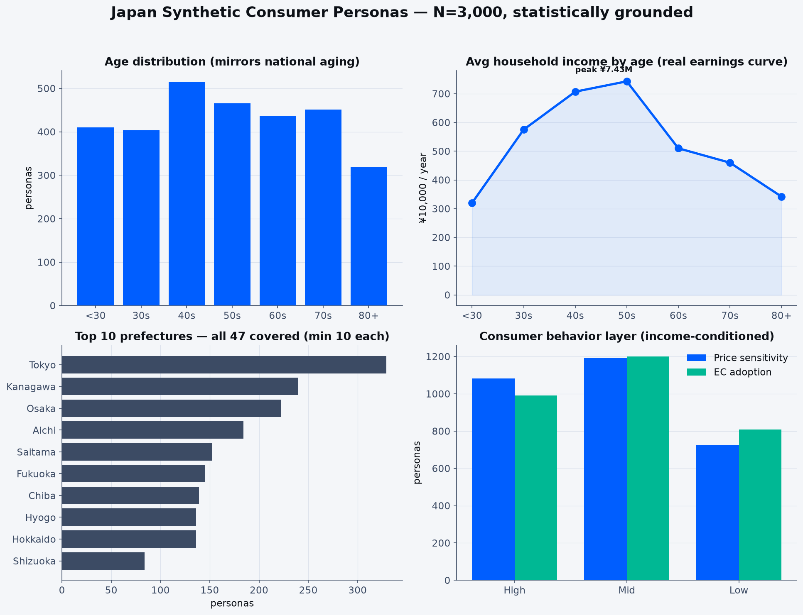

# Japan Synthetic Consumer Personas (N=3,000)

[](https://huggingface.co/datasets/furuchanchan/japan-synthetic-personas)
[](LICENSE)
[](https://discord.gg/JMVG53hGKS)

**3,000 synthetic Japanese consumer personas, statistically grounded** in national demographics and household-income distributions. Each persona carries consumer-behavior attributes (price sensitivity, brand orientation, channels, EC adoption, media) and a **first-person life narrative** (`backstory_250w`). Built for concept testing, survey simulation, agent-based simulation, and LLM evaluation personas.



> **The dataset itself lives on Hugging Face** → https://huggingface.co/datasets/furuchanchan/japan-synthetic-personas
> This repository holds the **generation pipeline (reproduction code) and methodology**.

---

## 🚀 Quickstart

```python
from datasets import load_dataset

ds = load_dataset("furuchanchan/japan-synthetic-personas", split="train")
print(len(ds), "personas")        # 3000
print(ds[0]["backstory_250w"])    # first-person narrative (Japanese)
```

- [`examples/quickstart.py`](examples/quickstart.py) — load + segment in 30 seconds
- [`examples/synthetic_survey.py`](examples/synthetic_survey.py) — **run an LLM-driven concept test over the personas** (the core use case)

## 💬 Community

Questions, feedback, and use cases on Discord → https://discord.gg/JMVG53hGKS
質問・フィードバック・活用事例は Discord でどうぞ → https://discord.gg/JMVG53hGKS

## 🌐 Language

Column **names are in English**; column **values are in Japanese** (this is a dataset of Japanese consumers — values are kept native). A complete **Japanese → English value reference** table is in the [**dataset card**](https://huggingface.co/datasets/furuchanchan/japan-synthetic-personas#value-reference-japanese--english), so the data is usable without reading Japanese.

---

## What's here

```
.
├── dataset/
│   ├── README.md                  # data card (bilingual EN/JA — full spec)
│   ├── sample_50.csv              # first 50 rows (full data on HF)
│   ├── distribution_3000.json     # distribution summary
│   └── images/overview.png        # overview visual
├── examples/                       # usage examples (load, synthetic survey)
├── scripts/                        # generation pipeline (00–08)
└── LICENSE                         # CC BY 4.0
```

The full data (`japan_personas_3000.csv` / `.jsonl`, ~28MB) is on Hugging Face. Only a 50-row sample is bundled here.

## How it was built (3-layer cascade)

1. **L0 population** — stratified sample of NVIDIA [Nemotron-Personas-Japan](https://huggingface.co/datasets/nvidia/Nemotron-Personas-Japan) by `age_band × sex` to match population proportions → 3,000 personas.
2. **Income grounding** — `P(income | head-of-household age)` from e-Stat "Comprehensive Survey of Living Conditions" + prefecture income index from "National Survey of Family Income and Expenditure", for joint age × region conditioning.
3. **L1 consumer layer** — income-tier-conditioned 3-type assignment of price sensitivity, brand orientation, channels, etc. (keeps both poles, avoids homogenization).
4. **Narrative** — name-based first-person interview format (avoids attribute-listing and stereotyping).

Official statistics:
- Comprehensive Survey of Living Conditions (MHLW, e-Stat `0003131978`)
- National Survey of Family Income and Expenditure (MIC, e-Stat `0003426512`)

### Reproduce
Run `scripts/` in numeric order. The e-Stat API key is read from an environment variable and is not in the code. Full data spec (EN + JA) → [`dataset/README.md`](dataset/README.md).

## License & Attribution

This repository and dataset are released under **CC BY 4.0** ([LICENSE](LICENSE)).

- **Base**: NVIDIA Nemotron-Personas-Japan (CC BY 4.0), modified
- **Statistical grounding**: "Comprehensive Survey of Living Conditions" (MHLW) and "National Survey of Family Income and Expenditure" (MIC), processed via e-Stat
- **`backstory_250w`**: generated text by Anthropic Claude (claude-sonnet-4-6); factual accuracy not guaranteed

Full attribution and disclaimer → [`dataset/README.md`](dataset/README.md).

Created by 株式会社TechWorker.

---

## 日本語

日本の人口構成・世帯所得分布に統計的に接地した合成消費者ペルソナ **3,000体**。各人物に消費行動属性と一人称の生活叙述（`backstory_250w`）が付きます。新商品コンセプトテスト・合成調査・エージェントシミュレーション・LLM評価ペルソナ向け。

- **データ本体は Hugging Face** → https://huggingface.co/datasets/furuchanchan/japan-synthetic-personas
- このリポジトリは**生成パイプライン（再現コード）と方法論**
- データの値は日本語のまま。列の意味の**日英対訳表**は[データカード](https://huggingface.co/datasets/furuchanchan/japan-synthetic-personas#value-reference-japanese--english)に収録
- 詳細な日本語ドキュメント（概要・列定義・作り方・ライセンス）→ [`dataset/README.md`](dataset/README.md)
